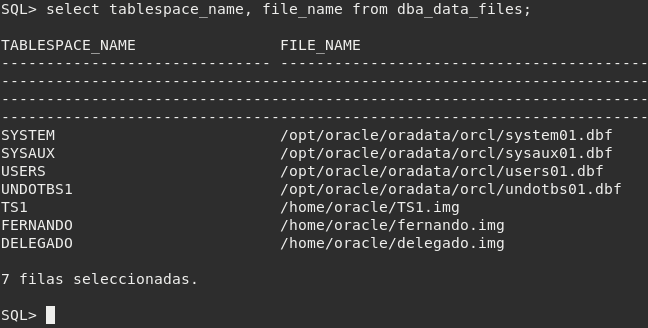
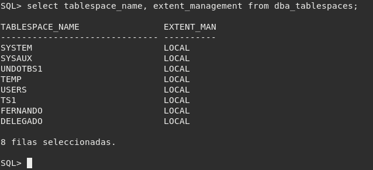
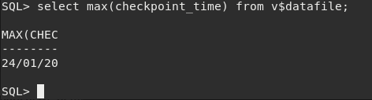
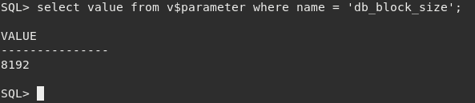
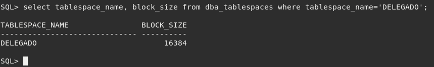
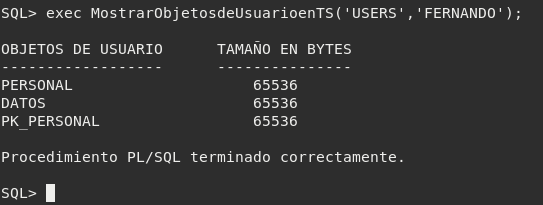
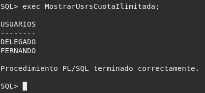
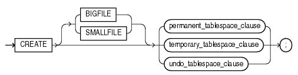
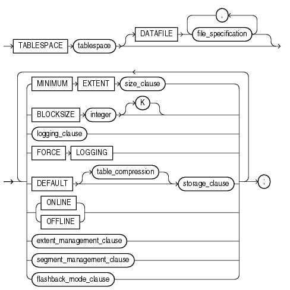
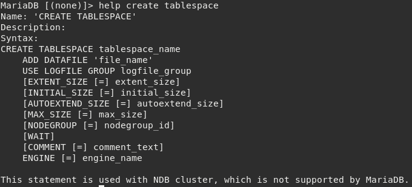

# ALUMNO 1

## ORACLE

### 1. Muestra los espacios de tablas existentes en tu base de datos y la ruta de los ficheros que los componen. ¿Están las extensiones gestionadas localmente o por diccionario?

Para mostrar lo pedido realizamos la siguiente consulta:

Para ver de que forma estan gestionadas las extensiones, hacemos la siguiente consulta:

Las extensiones estan gestionadas localmente. La gestión de las extensiones se elige en la instalación de Oracle y no se puede cambiar una vez elegida.

### 2. Usa la vista del diccionario de datos v$datafile para mirar cuando fue la última vez que se ejecutó el proceso CKPT en tu base de datos.

El Checkpoint Process (CKPT) escribe en los ficheros de control una serie de checkpoints. Estos puntos de sincronización, son referencias al estado coherente de todos los ficheros de la base de datos en un instante determinado.

Con la siguiente sentencia veremos cuando fue la última vez que se ejecutó este proceso:

### 3. Intenta crear el tablespace TS1 con un fichero de 2M en tu disco que crezca automáticamente cuando sea necesario. ¿Puedes hacer que la gestión de extensiones sea por diccionario? Averigua la razón.

Creamos el tablespace indicándole el nombre, la ruta, el tamaño y que crezca automáticamente:

~~~
SQL> CREATE TABLESPACE TS1 DATAFILE '/home/oracle/TS1.img' SIZE 2M AUTOEXTEND ON;

Tablespace creado.
~~~

No, la gestión de extensiones se elige en la instalación de Oracle y luego no puede cambiarse. 
La gestión local da mejor rendimiento, pero se ignora la claúsula STORAGE de los objetos del tablespace.

### 4. Averigua el tamaño de un bloque de datos en tu base de datos. Cámbialo al doble del valor que tenga.

Vamos a averiguar el tamaño de un bloque de datos en mi base de datos:

No se puede cambiar el tamaño de un bloque de datos de un tablespace, por lo que vamos a realizar esta tarea creando un nuevo tablespace.

Lo primero que vamos a hacer es inicializar el parametro 16K (doble de 8K) dándole un tamaño, por ejemplo 50 M:

~~~
SQL> ALTER SYSTEM SET DB_16k_CACHE_SIZE=50M;

Sistema modificado.
~~~

Reiniciamos para que se efectuen los cambios:

~~~
SQL> SHUTDOWN IMMEDIATE;
Base de datos cerrada.
Base de datos desmontada.
Instancia ORACLE cerrada.

SQL> STARTUP
Instancia ORACLE iniciada.

Total System Global Area 1660944384 bytes
Fixed Size		    2925072 bytes
Variable Size		  989859312 bytes
Database Buffers	  654311424 bytes
Redo Buffers		   13848576 bytes
Base de datos montada.
Base de datos abierta.
~~~

Creamos el tablespace con el doble de tamaño:

~~~
SQL> CREATE TABLESPACE DELEGADO DATAFILE '/home/oracle/delegado.img' SIZE 1M BLOCKSIZE 16K;

Tablespace creado.
~~~

Comprobamos que tiene el tamaño que le hemos especificado:

### 5. Realiza un procedimiento MostrarObjetosdeUsuarioenTS que reciba el nombre de un tablespace y el de un usuario y muestre qué objetos tiene el usuario en dicho tablespace y qué tamaño tiene cada uno de ellos.

El procedimiento sería el siguiente:

~~~
create or replace procedure MostrarObjetosdeUsuarioenTS(p_nombrets VARCHAR2,
							p_usuario VARCHAR2)
is

	cursor c_tablespace
	is
	select segment_name, bytes
	from dba_segments
	where tablespace_name = p_nombrets
	and owner = p_usuario;

begin
	dbms_output.put_line(chr(10)||'OBJETOS DE USUARIO'||chr(9)||'TAMAÑO EN BYTES');
	dbms_output.put_line('------------------'||chr(9)||'---------------');
	for i in c_tablespace loop
		dbms_output.put_line(RPAD(i.segment_name,27)||' '||RPAD(i.bytes,10));
	end loop;

end;
/
~~~

Lo probamos:

### 6. Realiza un procedimiento llamado MostrarUsrsCuotaIlimitada que muestre los usuarios que puedan escribir de forma ilimitada en más de uno de los tablespaces que cuentan con ficheros en "/home/oracle".

La cuota es ilimitada cuando el máximo número de bloques y de bytes tienen valor "-1" en la vista "DBA_TS_QUOTAS".

El procedimiento sería el siguiente:

~~~
create or replace procedure MostrarUsrsCuotaIlimitada
is
	cursor c_usuario
	is
	select username
	from DBA_TS_QUOTAS
	where tablespace_name in (select tablespace_name
				  from DBA_DATA_FILES
				  where substr(file_name,1,12) = '/home/oracle')
	and max_bytes = '-1'
	and max_blocks = '-1'
	group by username
	having count(tablespace_name) > 1;

begin
	dbms_output.put_line(chr(10)||'USUARIOS'||chr(10)||'--------');
	for i in c_usuario loop
		dbms_output.put_line(i.username);
	end loop;
end;
/
~~~

Lo probamos:

       
## POSTGRESQL
       
### 7. Averigua si existe el concepto de tablespace en Postgres, en qué consiste y las diferencias con los tablespaces de ORACLE.

Si existe. Los tablespaces en PostgreSQL permiten definir los lugares, en el sistema de ficheros, donde los archivos de la base de datos se pueden almacenar.

La sintaxis en PostgreSQL es de la siguiente manera:

~~~
CREATE TABLESPACE nombre_tablespace
[ OWNER { nuevo_dueño | CURRENT_USER | SESSION_USER } ]
LOCATION 'directorio'
[ WITH ( opcion_tablespace = valor [, ... ] ) ]
~~~

Mientras que la sintaxis en Oracle es de la siguiente manera:

- En PostgreSQL la ubicación debe ser un directorio vacío o existente propiedad del usuario postgres.
- Si la partición o volumen en el que se ha inicializado el grupo se queda sin espacio y no puede ser extendida, un tablespace se puede crear en una partición diferente y utilizarse hasta que el sistema puede ser reconfigurado.
- Una gran diferencia respecto a Oracle, es que PostgreSQL no tiene la posibilidad de restringir el tamaño del tablespace
- Los tablespaces permiten optimizar el rendimiento: por ejemplo, si tenemos determinados datos a los que accedemos constantemente, los ubicaremos en medios de almacenamiento más rápidos que a los que raramente accedemos.
- Mientras que en Oracle tratas con "datafiles" concretos, en PostgreSQL tratas con directorios.

## MARIADB

### 8. Averigua si pueden establecerse cláusulas de almacenamiento para las tablas o los espacios de tablas en MySQL.

En las tablas si pueden establecerse cláusulas de almacenamiento, las más importantes al crear las tablas son:

~~~
  | [STORAGE] ENGINE [=] nombre_motor
  | AUTO_INCREMENT [=] valor #Activar el crecimiento automático
  | DATA DIRECTORY [=] 'ruta absoluta al directorio'
  | INDEX DIRECTORY [=] 'ruta absoluta al directorio'
  | ENCRYPTED [=] {YES | NO} #Opción de encriptar
  | MAX_ROWS [=] valor #Determina el máximo número de registros
  | MIN_ROWS [=] valor #Determina el mínimo número de registros
  | ROW_FORMAT [=] {DEFAULT|DYNAMIC|FIXED|COMPRESSED|REDUNDANT|COMPACT|PAGE} #Formato de registro
~~~

En MariaDB no estan soportados los tablespaces, como vemos al final de esta imagen:

## MONGODB

### 9. Averigua si existe el concepto de índice en MongoDB y las diferencias con los índices de ORACLE. Explica los distintos tipos de índice que ofrece MongoDB.

Los índices en Oracle guardan parejas de elementos: el elemento que se desea indexar y su posición en la base de datos. Oracle buscará en el índice del elemento indexado que queramos para devolver el registro que se en cuentre en la posición marcada por el índice.

Los índices en MongoDB se generan en forma de árbol, esto incrementa la velocidad a la hora de realizar consultas. Hay varios tipos de índices:

- Simples: Este tipo se aplica a un solo campo de nuestra colección. Ejemplo:

~~~
db.users.ensureIndex( { "codigo" : 1 } ) 

# El 1 indica orden ascendente y el -1 descendente.
~~~

- Compuestos: Este tipo se aplica sobre varios campos de nuestra colección. Ejemplo:

~~~
db.users.ensureIndex( { "nombre" : 1, "edad":-1 } ) 
~~~

Lo bueno de estos índices es que podemos consultar varios campos sin la necesidad de incluirlos todos.

- Únicos: Con este índice conseguimos que un índice simple o compuesto este obligado a contener valores únicos. Ejemplo:

~~~
db.users.ensureIndex( { "codigo" : 1 }, {"unique":true} )
~~~

- Sparse: Normalmente un índice incluye todos los documentos, incluso los valores null. Con esta opción hacemos que un índice no incluya dichos documentos. Ejemplo:

~~~
db.users.ensureIndex( { "nombre" : 1 }, {"sparse":true} )
~~~

- Multikey: Permite crear índices sobre elementos almacenados en arrays y se realiza automáticamente cuando creamos un índice. Ejemplo:

~~~
Colección: { codigo: 5, nombre: "fernando", notas: [ 5, 8, 9 ] }

db.users.ensureIndex( { "notas" : 1 } )
~~~
